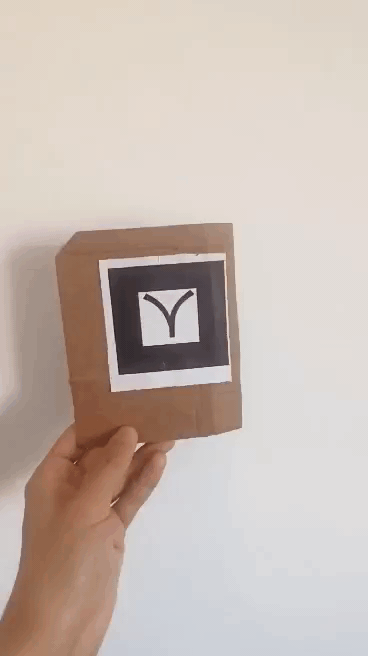
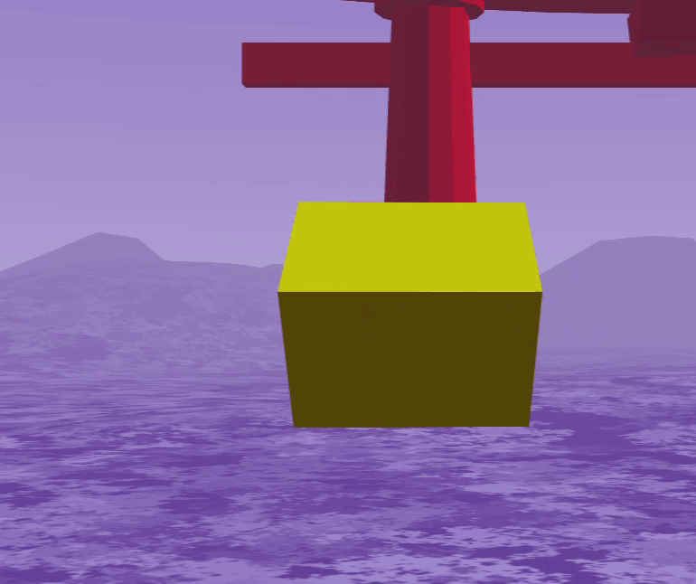

# Angle Detector Single Marker Component
For [A-Frame](https://aframe.io).

A part of the [VR Tangible Interaction Toolkit](../), a family of components that aims to facilitate the programing of VR interactions with fiducial markers.

This component aims to give the user the possibility of attach the angle rotation of a marker to a variable. The systems record in real time the angle in a chosen axis and emit an event to the rotating object (or additional targets) every time the rotations passes the input threshold.

In the following set of images of gifs, when the marker with the cube rotate 45º, an event is emitted, and the cube into red or yellow.

|||
|------------|-------------|
|  |   | 


### mt-angle-detector-sm
| Property | Description | Type | Default Value |
| -------- | ----------------- | ---- |------------- |
| threshold | An event will be emitted every time this threshold is reached . | float | 20    |
| eventTargets | Optional targets to emit event. | selectorAll |  |
| axis | Axis to detect rotation. | array | ['x', 'y', 'z'] |
| debug | Optional parameter to activate debug prints. | boolean  |false |

#
### How to use
The component can be attached to an object like in the following example:
```html
<a-box mt-angle-detector-sm="threshold:45; eventTargets: #box1,#box2; axis:x,y; debug: True" ></a-box>
```

#
### Events

| Name | Description |
| -------- | ----------------- |
| event_rotation | Event corresponding to the positive rotation of the marker . |

An event called rotation_event will be emitted every time the interaction detected. Inside this event, there will be some fields with additional information like a timestamp (in ms) the axis where the rotation was detected, the direction (positive or negative), and the object rotated.
```js
const event_rotation = new CustomEvent('event_rotation', {
    detail: {
      time: time,
      axis: axis ,
      direction : direction,
      threshold: this.threshold,
      object : this.el
    },
});
```

The additional information can be accessed in the 'detail' field of the 'event_rotation' like in the following example:
```js
document.getElementById('id').addEventListener('event_rotation', e=>{
    if(e.detail.direction == 'positive'){
        console.log('Rotation of +', e.detail.threshold, ' angles in ', e.detail.axis, ' axis.')
    }   
    else if(e.detail.direction == 'negative'){
        console.log('Rotation of -', e.detail.threshold, ' angles in ', e.detail.axis, ' axis.')    
}
})
```


### Examples

* [Example 1](examples/example1.html)
* [Example 2](examples/example2.html)