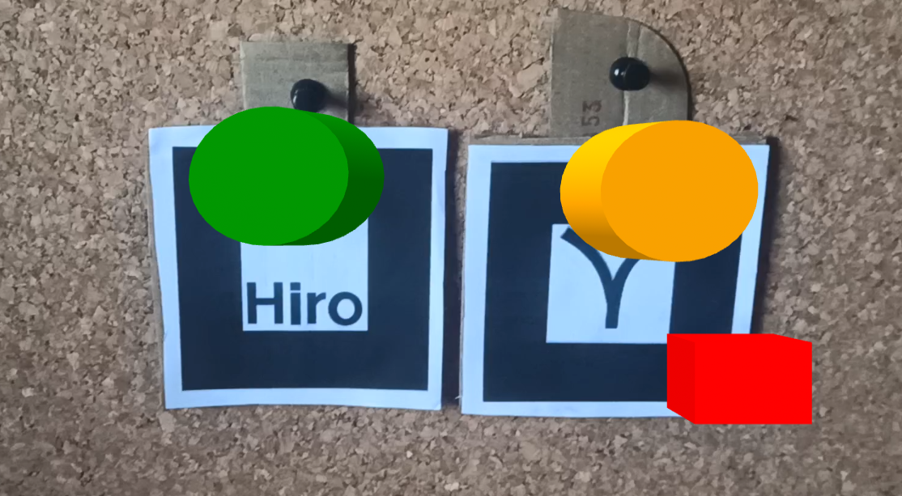
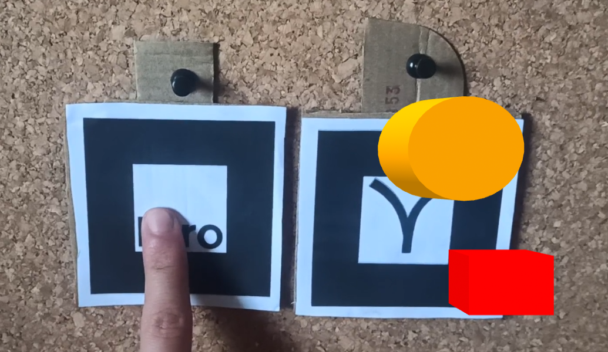
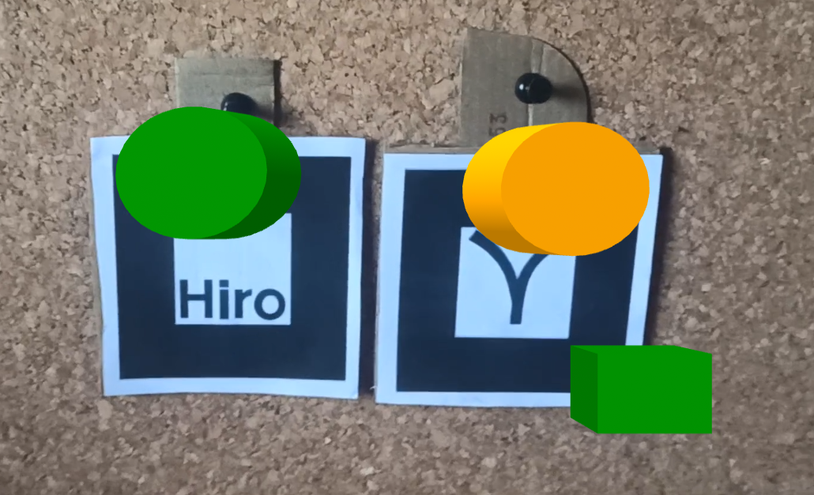

# Button Component
For [A-Frame](https://aframe.io).

A component that aims to give the user the possibility of a button interaction. The systems record in real time the visibility of the reference and auxiliary markers and emit an event to the reference marker (or additional targets) every time the auxiliary marker is occult for time defined by the user.

In the following set of images of [example 1](examples/example1.html), when the marker with the green cylinder is clicked, an event is emmited, and the red cube turn green.

||||
|------------|-------------|---------|
|  |   |   |


#
### mt-button


| Property | Description | Type | Default Value |
| -------- | ----------------- | ---- |------------- |
| reference | A reference to another marker that need to be in scene to detect the interaction. | selector |     |
| eventTargets | Optional targets to emit event. | selectorAll |  |
| minimumTime | Minimum time (in ms) that the marker need to be ocult to emit event. | int | 1000 |
| debug | Optional parameter to activate debug prints. | boolean  |false |


#


### How to use


The component can be attached to a reference  marker object like in the following example:


```html
 <a-marker id = 'ref' preset='kanji' >
      <a-cylinder color="orange" position='0 0 2' radius="0.3" height="0.2"></a-cylinder>
    </a-marker>

    <a-marker preset='hiro' mt-button="referenceMarker: #ref ;eventTargets: #box; minimumTime: 100; debug: true;">
      <a-cylinder color="green" position='0 0 -2' radius="0.3" height="0.2" ></a-cylinder>
    </a-marker>


  <a-box id='box' position="3 0 -10" color="red" event-set__event_button_pressed="color:green"> </a-box>
```


### Events


| Name | Description |
| -------- | ----------------- |
| event_button_pressed| Event corresponding to the pressing of the button (marker).


An event called event_button_pressed will be emitted every time the interaction detected.

```js
 const event_button = new CustomEvent('event_button_pressed', {
    detail: {
      time: time ,
      object : this.el
    }
});
```


Inside this event, there will be some fields with additional information like a timestamp (in ms) and the object that works as reference.


```js
document.getElementById('id').addEventListener('event_button_pressed', e=>{
    console.log('Button pressed with reference +', e.detail.object, '. Time: ', e.detail.time)
})
```


### Examples

* [Example 1](examples/example1.html)