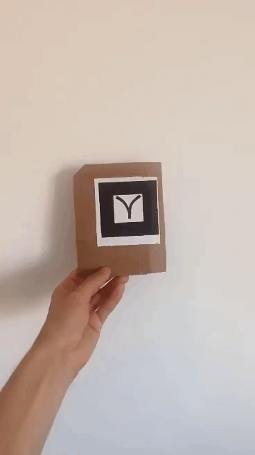

 A-Frame Shake Detector Component
For [A-Frame](https://aframe.io). 

A part of the [VR Tangible Interaction Toolkit](../), a family of components that aims to facilitate the programing of VR interactions with fiducial markers.

This component aims to give the user the possibility of detect a shake movement of an object. The systems record in real time the positions in the chosen axes and emit an event to the object (or additional targets) every time the interaction is detected according to the specification given by the user.

In the following set of gifs, the marker with the blue sphere is shaking in the z axis, and an event is emitted to turn the yellow cube into red.

|||
|------------|-------------|
| |   | 


#
### mt-shake-detector

| Property | Description | Type | Default Value |
| -------- | ----------------- | ---- |------------- |
| switchInterval | Maximum time (in ms) defined between two direction switches. | int |   1000     |
| minimumSwitchTimes | Number of direction switches to emit event. | int | 3 |
| minimumDistance | Mimimum virtual distance to count movement between direction switches valid. | float | 0.5 |
| eventTargets | Optional targets to emit event. | selectorAll |  |
| axis | Axis to detect movement switches. | array | ['x', 'y', 'z'] |
| debug | Optional parameter to activate debug prints. | boolean  |false |
#
### How to use
The component can be attached to an object like in the following examples:
```html
<a-marker preset = 'hiro'  
          mt-shake-detector = "switchInterval: 500 ; minimumSwitchTimes: 3 ; minimumDistance: 0.3 ; eventTargets:#myBox; axis:y ; debug: true;">
</a-marker>
```
#
### Events
| Name | Description |
| -------- | ----------------- |
| event_shake | Event emited when  the shake movement's detected. |

An event called shake_event will be emitted every time the object is shaken according to the proprieties given by the user.
Inside this event, there will be some fields with additional information like a timestamp (in ms) the axis where the shake movement was detected, and the object shaked.
```js
const event_shake = new CustomEvent('event_shake', {
    detail: {
      time: time ,
      axis: elem,
      object : this.el
    }
})
```
The information related to the event can be accessed in the 'detail' field like in the following example:

```js
document.getElementById('id').addEventListener('event_shake', e=>{
    console.log('Swipe sequence detected. Sequence: ', e.detail.sequenceIndex, ', ', e.detail.sequence, '. Time: ', e.detail.time)
})
```


#
### Examples

* [Example 1](examples/example1.html)
* [Example 2](examples/example2.html)
* [Example 3](examples/example3.html)